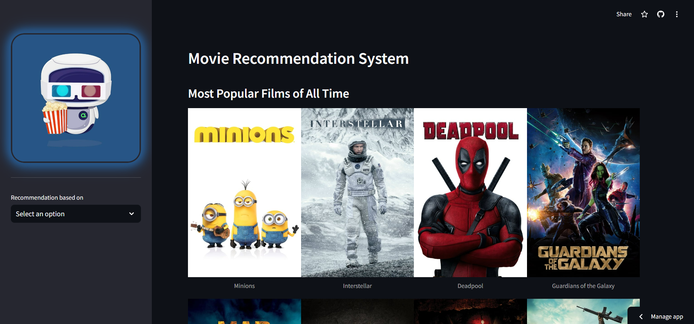

# Movie Recommendation System

## Overview
-----------

This is a movie recommendation system that uses machine learning and natural language processing techniques to suggest similar movies based on various factors such as:

* **Movie similarity**: recommends movies that are similar to the one selected by the user
* **Genre-based recommendation**: recommends movies of the same genre as the one selected by the user
* **Actor-based recommendation**: recommends movies featuring the same actor as the one selected by the user
* **Director-based recommendation**: recommends movies directed by the same director as the one selected by the user

## Live Demo

You can access the live demo of the application [here](https://movie-recommendation-system-230.streamlit.app/).




## Installation

### Prerequisites

- Python 3.10

### Instructions

1. Clone the repository:
    ```sh
    git clone https://github.com/NandaKishoreYadav/Movie-Recommendation-System.git
    ```
2. Open a command prompt from the project directory and create a new virtual environment:
    ```sh
    python -m venv myenv
    ```
3. Activate your environment:
    - On Windows:
        ```sh
        myenv\Scripts\activate
        ```
    - On Mac/Linux:
        ```sh
        source myenv/bin/activate
        ```
4. Install the necessary dependencies:
    ```sh
    pip install -r requirements.txt
    ```
5. Run the application:
    ```sh
    streamlit run app.py
    ```

## Usage

Once the application is running, you can choose from various options such as recommendations based on actor, genre, director, or select your favorite movie. This allows for a personalized movie experience, catering to your specific interests and preferences.

## Contact

If you have any questions or feedback, please feel free to reach out.

Thank you for using Movie Recommendation System! 😊
